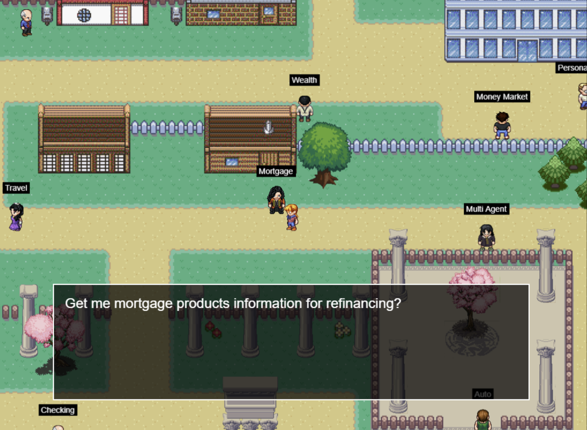

  <h1>Banking Agents</h1>
  <h3>AI-powered domain driven agents </h3>

 

    

## 📖 Overview

Multi-agent banking solution built with Google ADK, composed of a Master Agent and multiple vertical/domain Specialist Agents for banking products and services: credit cards, auto, mortgage, savings/checking, and travel. It covers offline data preparation, online inference flows, retrieval strategy, hosting, security, observability, and deployment.
### 🎮 

Design:
 - Master Agent routes user questions to the most relevant Specialist Agent using intent classification and tool availability.
 - Specialist Agents operate within bounded contexts, each with its own domain vector datastore and tools for domain data access.
 - Two operating modes:
    - Offline: crawl, clean, chunk, embed, and index domain content
    - Online: retrieve-augment-generate (RAG) with vLLM-hosted Llama 8B

Interactive experience:

    

** Credits: HTML5 UI (Phaser framework) experience credits from https://github.com/neural-maze 

    

-------
## Components

### UI Layer

- Parent container hosts multiple domain chatbots and a Master chatbot.
- Each chatbot connects to its corresponding FastAPI agent endpoint via secure WebSocket on HTTPS.

### Master Agent (FastAPI)

- Responsibilities
    - Intent detection and domain routing
    - Tool/knowledge selection
    - Fallback and disambiguation prompts when confidence is low
- Techniques
    - Zero-shot or few-shot routing prompt with tool descriptions
    - Optional lightweight classifier using vector similarity over domain descriptors
    - Observability: capture route decision, confidence, latency

### Specialist Agents (FastAPI)

- Responsibilities
    - Bounded-context orchestration
    - Retrieval across the domain vector store with hybrid search
    - Response generation via vLLM
- Tools
    - Domain retriever (top_k=3, vector + BM25 hybrid, cross-encoder rerank)
    - Domain-specific APIs or data sources if applicable (e.g., credit card offers API)

### Retriever

- Hybrid pipeline
    - Semantic vector search  over vectorDB  to get documents along with Vector score (score_V)
    - Augment with BM25 search  to  get top documents and BM25 lexical score  for these docs(score_B)
    - Weighted average of score_V and score_B as per business needs  . Pick the docs that matches these scores
    - Cross-encoder reranking to improve MRR and nDCG
- Parameters
    - top_k initial candidates: 50
    - rerank top 20 with cross-encoder, return final 3
    - dedup by URL and passage hash
- Chunking
    - Markdown-aware, aim for 300–700 tokens with 10–15 percent overlap
- Embeddings
    - Domain-tuned or strong general embedding model; cosine distance index

### vLLM Serving

- Model: Llama 3.1 8B (or equivalent 8B) on GPUs
- Optimizations: tensor and sequence parallelism, KV cache, PagedAttention
- Horizontal scaling: multiple pods with GPU requests/limits; HPA on RPS and latency
- Placement: node selectors to map pods to GPU nodes; optional MIG partitioning
- Endpoint
    - OpenAI-compatible API
    - Rate limiting and request batching (max_tokens, best_of, n)

---

## Offline Data Preparation

- Sources: configured websites per domain
- Pipeline: Crawl4AI → HTML → Markdown → Clean → Chunk → Embed → Index
- Storage: per-domain vector DBs with metadata {domain, url, title, section_id, hash, timestamp}
- Scheduling: daily incremental crawl with change detection (ETag, Last-Modified, checksum)
- QA guardrails: broken link detection, token length constraints, profanity filter in content

---

## Online Inference Flows

### Scenario 1: Vertical Agent

1) User asks in domain chatbot

2) Specialist Agent calls Retriever on domain store

3) Retrieved contexts sent to vLLM

4) Agent composes grounded answer with citations

### Scenario 2: Master Agent

1) User asks in Master chatbot

2) Master Agent reasons and selects Specialist Agent

3) Delegates request with user context and trace id

4) Specialist Agent retrieves and calls vLLM

5) Response returns via Master to UI

##Installation instructions:   

Install uv in your current working directory:
https://docs.astral.sh/uv/getting-started/installation/

Install git
https://github.com/git-guides/install-git

#Create virtual env .venv
uv venv .venv

#Activate the created virtual environment 
source .venv/bin/activate

### Inside .venv , perform following :

###Download the Repo
git clone https://github.com/nprasha76/GenAI

cd philoagents-course/philoagents-api/

pip install -r requirements.txt
###Install Agents 
uv pip install external/rootAgentPro
uv pip install external/savingsAgentPro
uv pip install external/creditAgentPro
uv pip install external/autoAgentPro
uv pip install external/mortgageAgentPro
uv pip install external/travelAgentPro

playwright install
sudo playwright install-deps

###Install faiss-gpu if you have GPU .Otherwise install faiss-cpu

pip install faiss-cpu
pi install  faiss-gpu

###Launch FastAPI server

python -m src.philoagents.infrastructure.api

### Run UI 
#### Open another terminal (outside .venv) 

cd philoagents-course/philoagents-ui
#Install node 
https://nodejs.org/en/download

### Launch UI
npm run dev

###Offline 

### Generate embeddings for each of agent .Repeat the below process for each agent

### cd external/<Agent>Pro/src/chase_embeddings folder 

###Modify the paths in createEmbeddings.py accordingly . 

Improvement :Load Path location from .env file

###Create embeddings

###python createEmbeddings.py 

Modify *_meta.json to point to exact path of embeddings generated

### Host model

### Use appropriate model as per your system requirements .Adjust parameters accordingly

### Install VLLM 

pip install --upgrade pip
pip install vllm --no-cache-dir 

### Launch VLLM with tool support

python -m vllm.entrypoints.openai.api_server \
    --model TechxGenus/Meta-Llama-3-8B-Instruct-GPTQ\
    --quantization gptq \
    --max-model-len 2048 \
    --max-num-seqs 2 \
    --gpu-memory-utilization 0.95 \
    --enable-auto-tool-choice \
    --tool-call-parser llama3_json

